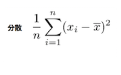
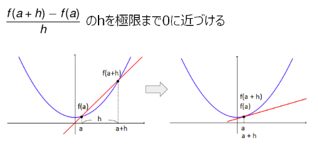

# Python勉強会問題集

## 問題1

次の⺟集団データがあります。

> x = [80, 82, 65, 45, 72, 66, 68, 90, 83, 77]

1. 合計(728)を求めてください
2. 平均値(72.8)を求めてください
3. 分散(145.76)を求めてください
4. 標準偏差(12.073)を求めてください

- 分散

> 分散とはデータの散らばり具合を表すもので、平均から各データがどれだけ離れているかを表します。平均との差は正と負の値のどちらもあるため、それぞれの差を2乗した値を用いその平均を分散とします。分散は、平均と対象のデータの差の2乗した平均で求めることができます。



- 標準偏差

| 変数 | 意味 |
| --- | --- |
| n | データの総数 |
| x_{i} | データの値 |
| \overline{x} | データの平均 |

>標準偏差は、分散で求めたデータのばらつき具合を見やすくしたものです。分散は差を2乗しているため値が大きく、実際のデータのばらつきがわかりにくくなります。そこで分散の値の平方根を求め、ばらつきをわかりやすくした値が標準偏差です。標準偏差は、分散の値の平方根で求めることができます。

平方根は、`x ** 0.5`で求めることができます。


## 問題2 

次のリストがあります。

 > x = [ ['Python','2.7'],['Python','3.6'],['Python','3.8'],['Java','8'],['Java','11'] ] 

このリストを以下の辞書型に変換してください。

>  {'Python': ['2.7', '3.6', '3.8'], 'Java': ['8', '11']}

## 問題3

y = x^2 + 2x + 1　を x = 1 において微分する関数numerical_diffを定義してください。

ヒント1



ヒント2
```python
def numerical_diff(???):
    h = 0.00000000001
    ???

def func(x):
    return ???

result = numerical_diff(func, 1)
print(result)
```
